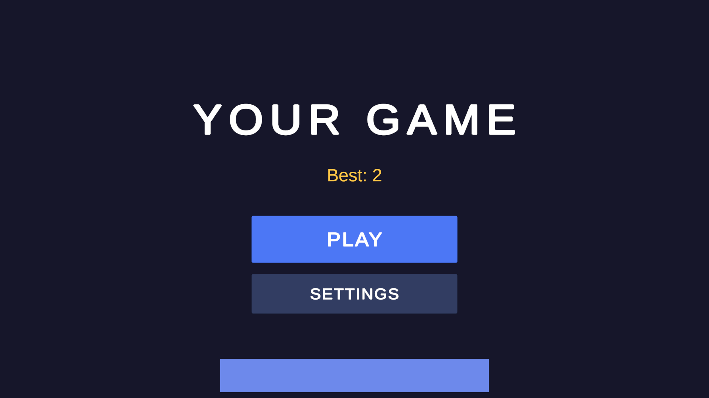
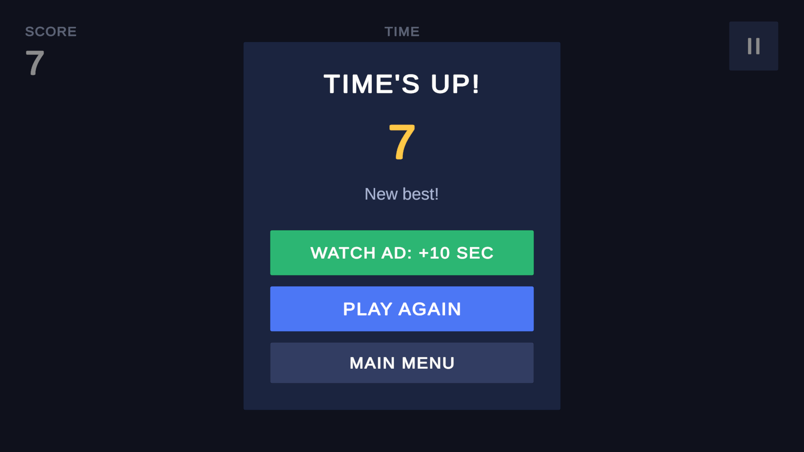
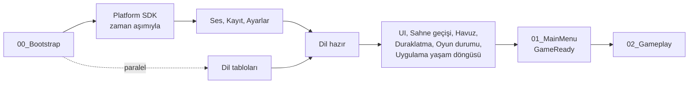

# Unity Web Mobile Game Template

Web ve mobil oyunlarını hızlı başlatmak için hazırlanmış, tekrar kullanılabilir bir **Unity 6 (6000.3.21f1)** şablonu. Hem **2D** hem **3D** oyunlar için kullanılabilir.

Her yeni oyunda yeniden yazılan altyapı (açılış, kayıt, ayarlar, ses, reklam, platform SDK'ları, arayüz, sahne geçişi, build kontrolleri) burada hazır gelir. Sen sadece oyunun kendisini `Assets/_Project` altına yazarsın.

- **Hedef platformlar:** CrazyGames (WebGL) bugün hazır. Google Play ve Yandex Games için yer ayrılmış durumda; köprüsü henüz olmayan platformlarda oyun yine çalışır, platform servisleri "boş" (Null) sürümlere düşer.
- **Render:** URP. 2D profilde `URP_2D`, 3D profilde mobile göre ayarlanmış `URP_3D`.
- **Girdi:** Input System (Active Input Handling: Both).

<p>
  
  
</p>

---

## Şu an ne durumda?

| Platform | Durum |
|---|---|
| **CrazyGames (WebGL)** | Hazır. Tüm SDK servisleri (reklam, kayıt, kullanıcı, banner, leaderboard, HappyTime) bağlı, Release build alınıyor. Localhost'ta tarayıcıda denendi (2026-10-04): açılış, sayfa yenileme, reklamlar ve kayıt çalışıyor. Gerçek portalda henüz denenmedi. |
| **Google Play (Android)** | Kısmen. Mobil temel hazır (60 FPS, Geri tuşu, arka plana alma, titreşim), development APK telefonda denendi (2026-10-04): menü, ses, titreşim, dil, Geri tuşu, arka plana alma ve kayıt çalışıyor; çentikli ekranda safe area tam doğru değildi; düzeltmesi (arka planlar tam ekran, içerik güvenli alanda) telefonda henüz yeniden denenmedi. `Android - Development` (APK) ve `Android - Release` (AAB) build profilleri hazır. Platform köprüsü yok: reklam, giriş ve bulut kaydı çalışmaz, kayıt cihazda (PlayerPrefs) tutulur. Reklam sağlayıcısı henüz seçilmedi. |
| **Yandex Games** | Köprü yok. Menüden seçilebilir; oyun Null servislerle çalışır. |
| **iOS** | Denenmedi. iOS modülüyle hiç build alınmadı. |

---

## Gereksinimler

- **Unity 6000.3.21f1** (Unity Hub ile). Modüller: **WebGL Build Support**; mobil için **Android Build Support** (OpenJDK, Android SDK & NDK ile birlikte); iOS için Mac'te **iOS Build Support**.
- **Git** kurulu ve PATH'te olmalı: Package Manager iki paketi GitHub'dan indirir.

## İlk çalıştırma

1. Projeyi Unity 6000.3.21f1 ile aç. İlk açılışta bütün asset'ler içe aktarıldığı için birkaç dakika sürer.
2. `Assets/_Project/Scenes/Bootstrap/00_Bootstrap.unity` sahnesini aç ve **Play**'e bas. `01_MainMenu`, `02_Gameplay` ve test sahneleri de doğrudan çalışır: içlerindeki `BootstrapGuard` önce açılış sahnesini yükler, sonra o sahneye döner.
3. Editörde reklamlar gerçek değildir, CrazyGames SDK'sı onları taklit eder; gerçek davranış ancak CrazyGames'te görülür.

---

## Neler hazır geliyor?

| Alan | Ne yapıyor |
|---|---|
| **Açılış (Bootstrap)** | `00_Bootstrap` sahnesi tüm sistemleri sırayla kurar, platform SDK'sını zaman aşımıyla başlatır, bir sistem hata verse bile ana menüyü açar. Bu sırada `LoadingScreen` prefab'ı oyun logosu, oyun adı ve gerçek ilerlemeyi gösteren bir yükleme çubuğu gösterir. |
| **Platform katmanı** | Oyun kodu SDK'yı hiç görmez; `PlatformManager.Instance.Ads / Storage / User / Leaderboard ...` üzerinden konuşur. Desteklenmeyen her servis güvenli bir Null sürümüyle gelir, hiçbir servis null değildir. `Capabilities` neyin gerçekten çalıştığını söyler. Uygulama içi satın alma için ortak bir arayüz (`PlatformManager.Instance.Purchases`) hazır; şu an hiçbir platformda bağlı değil. Platform oyunu duraklatmak isterse (örneğin Yandex) oyun duraklatma menüsünü açar ve ses kesilir. |
| **Reklamlar** | Tek merkezden kurallar: aynı anda tek reklam, ara reklam (interstitial) bekleme süresi (varsayılan 3 dk), reklam süresince arayüz kilidi ve ses kapatma, cevap vermeyen SDK için zaman aşımı, adblock'ta kendini kapatan ödüllü reklam butonu (`RewardedAdButton`), menüde banner. |
| **Kayıt** | `SaveManager`: bellek üstü cache, gecikmeli (debounce) yazma; uygulama arka plana alınınca, kapanınca ve WebGL'de sekme gizlenince ya da kapatılınca bekleyen kayıtları hemen yazar. Bozuk veriye karşı koruma; okunamayan bir kaydın üstüne körlemesine yazmaz, önce tekrar okur ve bulduğu kaydı korur. 1 MB sınır uyarısı. Yazma hata verirse artan aralıklarla yeniden dener. Kayıt sınıfları sürümlüdür: alan adı değişince `CurrentVersion` artırılır, eski kayıt `Migrate` ile çevrilir. Platform kaydı yoksa PlayerPrefs'e düşer. |
| **Ayarlar** | Müzik, efekt ve titreşim aç/kapa (titreşim düğmesi sadece Android/iOS'ta görünür), dil ve ilk açılış bilgisi kaydedilir ve uygulanır. |
| **Ses** | Müzik ve efekt kanalları (AudioMixer). Her ses bir `SoundData` asset'i (`Create > Audio > Sound`); kodda enum yok, sesi alana sürükleyip `AudioManager.PlaySfx(ses)` ile çalarsın. Sahne müziğini `SceneMusic` bileşeni başlatır, aynı müzik sahne değişince kesilmez. Butonlara eklenen `ButtonClickSound` tık sesini kendisi çalar. Ayarlardan aç/kapa, reklam ve platform (CrazyGames `muteAudio`) isteklerinde otomatik sessizlik. |
| **Arayüz** | `UIManager`: ekranlar tipleriyle açılır (`ShowScreen<MainMenuScreen>()`, `ShowPopup<PausePopup>()`), yeni ekran için enum yok, prefab'ı `UIConfig` listesine eklemek yeter. Ekranlar, üst üste açılan popup yığını, tek merkezden Geri/Escape tuşu, DOTween ile animasyonlu açılış/kapanış, safe area (çentikli ekranlar), reklam kilidi katmanı. Hazır ekranlar: ana menü, oyun içi HUD, ayarlar, dil seçimi, duraklatma, oyun sonu ve evet/hayır onay penceresi (`ConfirmPopup`). |
| **Çoklu dil** | Unity Localization ile Türkçe, İngilizce, İspanyolca ve Rusça (Yandex Games için). İlk açılışta platformun bildirdiği dil, o yoksa cihaz/tarayıcı dili seçilir (yoksa İngilizce); oyuncunun seçimi kaydedilir. Dil değişince bütün metinler anında güncellenir. Bir dilde eksik kalan metin İngilizcesiyle gösterilir. |
| **Duraklatma** | `PauseManager` `Time.timeScale`'in tek sahibidir: duraklatma menüsü, reklam ve arka plana alma (sekme gizlenmesi, platform isteği) kendi "duraklatma kaynağı" ile oyunu durdurur, hepsi bitince oyun devam eder. Yavaş çekim için `PauseManager.TimeScale`. |
| **Sahne geçişi** | `SceneTransition.LoadAsync(GameScenes.Gameplay)`: ekran kararır, sahne arka planda yüklenir (WebGL sayfası donmaz), ekran açılır. Geçiş sırasında dokunma kilitlenir; sahne değişince açık arayüz kendiliğinden kapanır. |
| **Oyun akışı** | `GameplayStateManager` seviye başı ve sonunu platforma bildirir (CrazyGames `gameplayStart/Stop`); duraklatma menüsü açılınca "durdu" bilgisini kendisi gönderir. `02_Gameplay` sahnesi tüm akışı gösteren küçük bir örnek oyundur: skor, süre, duraklatma, ödüllü "devam et", ara reklam, en iyi skor kaydı. |
| **Mobil temel** | Android/iOS'ta 60 FPS (ayarlanabilir), oyun sırasında ekranın kararmaması, uygulama arka plana gidince otomatik duraklatma, ayara uyan titreşim (`Haptics.Vibrate()`). Android Geri tuşu popup'ı kapatır, oyunda duraklatır, ana menüde "Oyundan çıkılsın mı?" diye sorar. |
| **Havuz (Pooling)** | `PoolManager` + `PoolConfig` (ya da çalışırken `CreatePool`) ile sık oluşturulan objeleri (mermi, düşman, efekt) tekrar kullanma. Konumlu `Get`, sadece objeyle `Release`; sahne değişince dışarıdaki objeler havuza kendiliğinden döner. |
| **Olay sistemi** | `EventBus`: sistemler birbirini tanımadan haberleşir; bir dinleyicinin hatası diğerlerini durdurmaz. Yayın sırasında bellek ayırmaz (WebGL'de takılma yapmaz). |
| **Platform seçimi** | `Tools/Template/Platform` menüsü platformu tek yerden seçer. Seçilmeyen platformların köprü kodu (`Assets/_Platforms`) derlenmez; CrazyGames SDK'sı da sadece CrazyGames seçiliyken derlenir ve build'e girer. Platforma ait eklentiler (.jslib, .aar) ve WebGL şablonu da seçime göre değişir. |
| **Build güvenliği** | `BuildValidator` her build'den önce sahne sırasını, test sahnelerinin build'e girmediğini, platform ayarının hedefe ve `PLATFORM_X` define'ına uyduğunu kontrol eder. |
| **Otomatik testler** | `Assets/_Core/Tests/Editor` altında EventBus, reklam politikası, kayıt, ayarlar, platform yöneticisi, obje havuzu, duraklatma, oyun durumu, dil eşleştirme ve Null servisler için 107 EditMode testi. `Window > General > Test Runner > EditMode` ile çalışır. |

### Akış



Reklam isteği: oyun kodu `PlatformManager.Instance.Ads` üzerinden ister → reklam politikası (tek reklam, bekleme süresi, zaman aşımı) karar verir → istek boyunca ses kısılır ve arayüz kilitlenir (`AdRequestedEvent`) → SDK cevap verince ya da süre dolunca her şey geri açılır (`AdRequestCompletedEvent`); istek boyunca `PauseManager` oyunu duraklatır, süre dolunca CrazyGames köprüsü SDK'nın kıstığı sesi geri açar, ödül sadece reklam tamamlanınca verilir.

---

## Editör araçları (menüler)

| Menü | Ne işe yarar |
|---|---|
| `Tools/Template/New Game Setup` | Yeni oyunun şirket adı, ürün adı, bundle id (Android/iOS/PC), sürüm, build numarası ve ekran yönünü tek pencerede ayarlar. Ekran yönüne göre arayüz çözünürlüğünü (yatay 1920x1080, dikey 1080x1920) ayarlar; isteğe bağlı uygulama ikonu ve yükleme ekranı logosu da buradan verilir. Ürün adı, Android'de dile göre gösterilen uygulama adı olarak da yazılır. |
| `Tools/Template/Set Up as 2D Game` / `Set Up as 3D Game` | Projeyi 2D veya 3D profile geçirir: render pipeline, `GAME_2D`/`GAME_3D` define'ı, kullanılmayan fizik motoru, ilgili paketler. Profil değişimini **hep bu menüyle** yap, elle değil. |
| `Tools/Template/Show Current Profile` | Projenin şu an hangi profilde olduğunu gösterir. |
| `Tools/Template/Platform/<platform>` | Hedef platformu seçer: `PlatformConfig.Platform` değerini ve WebGL/Android/iOS/PC için tek bir `PLATFORM_X` define'ını ayarlar, platformun WebGL şablonunu seçer (`Assets/WebGLTemplates/<Platform>` varsa o, yoksa Unity'nin Default şablonu). Diğer platformların köprüleri ve SDK eklentileri build'e girmez. Platformu **hep bu menüyle** değiştir. `Show Current Platform` mevcut durumu gösterir. |
| `Tools/Build/Validate Build Settings` | Build almadan build kontrollerini çalıştırır. |
| `CrazySDK/Development Build` / `Release Build` | CrazyGames için WebGL build alır (CrazySDK'nın kendi build ayarlarıyla). Günlük denemede Development, yüklemeden önce Release kullan. |
| `CrazySDK/Go to Analyzer` | Build boyutunu ve içeriğini analiz eder. |
| `Tools/Folder Creator` | Assets altında hiyerarşik klasör yapısı oluşturma penceresi. |

---

## Kullanılan paket ve asset'ler

| Paket | Nerede | Ne için |
|---|---|---|
| **DOTween** (Demigiant) | `Assets/ThirdParty/Demigiant` | Basit animasyonlar: popup açılış/kapanış, buton efektleri, sayı sayma. Arayüz animasyonları `SetUpdate(true)` ile oyun duraklatılmışken de çalışır. |
| **TextMeshPro** | Unity | Tüm metinler. Türkçe karakterler (ı İ ş ğ) LiberationSans'ın dinamik yedek fontundan gelir. |
| **Localization** (+ Addressables) | Unity | Çoklu dil. Ayarlar `Assets/Settings/Localization`, arayüz metinleri `Assets/_Project/Localization` (UI tablosu), altyapı metinleri `Assets/_Core/Localization/Tables` (Core tablosu). Tablolar oyun build'iyle birlikte derlenir (Addressables: Build with Player). |
| **Input System** | Unity | Klavye, dokunmatik ve gamepad girdisi; Android Geri tuşu da buradan gelir. |
| **Universal Render Pipeline** | Unity | 2D ve 3D render. |
| **2D paketleri** (Sprite, Animation, Tilemap, SpriteShape, Aseprite, PSD Importer) | Unity | Sadece 2D profilde yüklüdür; 3D profile geçince kaldırılır. |
| **CrazyGames SDK 5.31** | `Assets/CrazySDK` | Reklam, kayıt, kullanıcı, leaderboard, banner. Bu klasördeki SDK koduna dokunulmaz; sadece CrazyGames seçiliyken derlenir. |
| **Test Framework** | Unity | EditMode testleri (`Assets/_Core/Tests/Editor`). |
| **UI Particle** (mob-sakai, ParticleEffectForUGUI 4.13.3) | Package Manager (git) | Hazırda duran, örnek kodda **kullanılmayan** paket: Particle System efektlerini Canvas içinde göstermek için (ödül patlaması, konfeti). Gerekmiyorsa Package Manager'dan kaldırılabilir. |
| **UI Effect Snapshot** (mob-sakai, 1.0.1) | Package Manager (git) | Hazırda duran, **kullanılmayan** paket: ekran görüntüsünü bulanıklaştırıp popup arkasına koymak için. Gerekmiyorsa kaldırılabilir. |
| **Unity AI Assistant** | Unity (ön sürüm) | Sadece editörde çalışır, build'e girmez. Unity MCP: Claude'un açık editörü yönetip derleme/konsol kontrolü yapabilmesi için. |

---

## Yeni oyuna başlarken

1. Bu repodan yeni bir repo oluştur (GitHub'da **Use this template** ya da kopyala) ve Unity 6000.3.21f1 ile aç.
2. `Tools/Template/New Game Setup`: isim, bundle id, sürüm, ekran yönü, ikon, yükleme logosu.
3. `Tools/Template/Set Up as 2D Game` veya `Set Up as 3D Game`.
4. `Tools/Template/Platform` menüsünden hedef platformu seç (WebGL için CrazyGames, Android için Google Play). Leaderboard ayarları `Assets/_Project/ScriptableObjects/Config/PlatformConfig.asset` içinde; leaderboard varsayılan olarak **kapalı**; açmak için `Leaderboard Enabled` işaretle ve portaldan aldığın anahtarı gir.
5. Oyunu `Assets/_Project` altına yaz. Başlangıç noktası olarak `02_Gameplay` sahnesi ve `GameplayController` örneğine bak.
6. Yeni içerik `_Core`'a dokunmadan eklenir: arayüz için prefab'ı `UIConfig` listesine ekle ve `ShowPopup<SeninPopup>()` ile aç; ses için bir `SoundData` asset'i oluşturup alana sürükle; sahne için Build Settings'e ve `GameScenes` sınıfına adını ekle; havuz için `PoolConfig`'e kayıt ekle. Şablondaki örnek sesleri (`templateClickSound`, `templateMusic`) kendi seslerinle değiştir.
7. Kayıt sınıfında bir alanın adını değiştirir, silersen ya da anlamını değiştirirsen sınıfın `CurrentVersion` değerini artır ve eski veriyi `Migrate` içinde çevir. Yeni alan eklemek için buna gerek yok.
8. Build:
   - **WebGL (CrazyGames):** `File > Build Profiles` içinde bir Web profiline geç (hedefi WebGL yapar), sonra `CrazySDK/Development Build` veya `Release Build`. CrazySDK build'i profilin kendi ayarlarını kullanmaz, gereken ayarları kendisi yapar. Deneme ve yükleme adımları: [CrazyGames'te yayınlama](#crazygameste-yayınlama).
   - **Diğer web portalları (Yandex; köprüsü eklenince):** Unity'nin kendi Build düğmesiyle; masaüstü ağırlıklı portal için `Web - Desktop - Release` (DXT doku), mobil ağırlıklı portal için `Web - Mobile - Release` (ASTC doku). Profillere Player Settings override ekleme: şablonun define'larını ezer.
   - **Android (Google Play):** Google Play'i seç. Telefonda denemek için `Android - Development` (APK), Play Store'a yüklemek için `Android - Release` (AAB) profiliyle build al. IL2CPP + ARM64 gerekir. Yayın için `Player Settings > Publishing Settings > Keystore Manager` ile bir keystore oluştur; keystore dosyasını ve şifresini **repoya koyma** (`.gitignore` `*.keystore` / `*.jks` dosyalarını zaten dışarıda tutar), güvenli bir yerde yedekle: kaybedersen oyunu güncelleyemezsin.
   - Build listesinde 0. sahne `00_Bootstrap` olmalı, test sahneleri (`Scenes/Test`) olmamalı; `BuildValidator` bunu senin yerine kontrol eder.

---

## CrazyGames'te yayınlama

Oyunu CrazyGames'e yüklemek için bir CrazyGames geliştirici hesabı gerekir ([developer.crazygames.com](https://developer.crazygames.com)). Localhost'ta denemek için hesap gerekmez. Güncel kurallar: [teknik](https://docs.crazygames.com/requirements/technical), [reklam](https://docs.crazygames.com/requirements/ads), [oynanış](https://docs.crazygames.com/requirements/gameplay).

1. **Hazırlık:** `Tools/Template/Platform/CrazyGames (WebGL)` seçili ve `File > Build Profiles` içinde bir Web profili aktif olsun.
2. **Localhost'ta dene:** `CrazySDK/Development Build`. Build bitince Unity oyunu tarayıcıda `http://localhost:...` adresinde kendisi açar; CrazyGames SDK'sı burada gerçek haliyle yüklenir, reklamlar örnek reklamdır. Kontrol et:
   - İlk tıklamada ses başlıyor.
   - Ara ve ödüllü reklamda oyun duruyor ve ses kesiliyor, reklamdan sonra devam ediyor; ödül bir kez veriliyor.
   - Sayfayı birkaç kez yenile: yükleme ekranında takılmadan menü açılıyor, ayarlar ve skor duruyor.
   - Mobil hedefleniyorsa telefon tarayıcısında ya da tarayıcının cihaz emülasyonunda dokunmatik, ekran yönü ve arayüz ölçeği.

   Konsol için F12. Development build CrazyGames'te çalışmaz, sadece localhost içindir. Tarayıcıyı kapattıysan menüyü tekrar çalıştır ya da `Builds/CrazyGamesDevelopment` klasöründe `python -m http.server 8000` çalıştırıp `http://localhost:8000` adresini aç; `index.html` dosyasına çift tıklamak çalışmaz.
3. **Release build:** Oyun mobilde de oynanacaksa önce `CrazySDK/Go to Build` penceresinde "Runs on mobile web" işaretle. Açık sahneyi kaydet ve `CrazySDK/Release Build` çalıştır. Birkaç build aldığı için uzun sürebilir; çıktı `Builds/CrazyGamesRelease`.
4. **Boyut:** Build bitince Analyzer açılır (sonra `CrazySDK/Go to Analyzer`). Toplam boyut 250 MB'ı geçmemeli; ilk yükleme 50 MB'ın üstündeyse oyun reddedilebilir, 20 MB'ın üstündeyse mobilde kapatılabilir. Analyzer'ın işaretlediği büyük doku ve sesleri düzelt.
5. **Yükle ve dene:** Geliştirici portalında oyunu oluştur, `Builds/CrazyGamesRelease` klasörünün tamamını yükle ve portalın önizleme/QA aracında dene: oynanış başlat/durdur bildirimleri, reklamlar, adblock açıkken davranış, mobil.
6. **Gönder:** Portalda oyunun bilgilerini doldurup incelemeye gönder.

Şablonun hazır karşıladığı kurallar: reklam boyunca oyunun durması, sesin kesilmesi ve arayüzün kilitlenmesi; ara reklamlar arasında en az 3 dakika; ödülün sadece reklam tamamlanınca verilmesi; `gameplayStart/Stop` bildirimleri (`GameplayStateManager`); adblock'ta oyunun çalışmaya devam etmesi; banner'ın sadece menüde görünmesi. Senin dikkat etmen gerekenler (özet; kesin liste yukarıdaki kurallarda): oyun İngilizce oynanabilmeli, oyunda kendi tam ekran butonu ve dışarıya (App Store, başka site) link olmamalı.

Claude Code kullanıyorsan `/crazygames-release` bu adımları bir kontrol listesiyle yürütür.

---

## Test sahneleri

`Assets/_Project/Scenes/Test/` altındaki sahneler build'e girmez, editörde Play ile çalışır.

| Sahne | Ne denenir |
|---|---|
| `99_Test` | Klavye ile reklam: **B** banner göster, **H** banner gizle, **I** ara reklam, **R** ödüllü reklam, **P** ödüllü reklamı önceden yükle, **K** adblock kontrolü. Kayıt: **S** kaydet, **L** yükle, **D** sil. Kullanıcı, giriş, leaderboard ve HappyTime denemeleri `CrazyGamesUserTest` bileşeninin sağ tık menüsünde. |
| `99_Test3D` | 3D profil: klavye/gamepad (`Player/Move`) ya da ekrana basılı tutarak hareket eden Rigidbody oyuncu. |

---

## Metin ve dil ekleme

- **Yeni metin:** `Window > Asset Management > Localization Tables` > `UI` tablosuna bir anahtar ekle (ör. `shop.title`) ve dört dili doldur. Sabit yazılarda TMP objesine `Localize String Event` bileşeni ekleyip anahtarı seç ve `Update String` olayını `TextMeshProUGUI.text`'e bağla. Kodla değişen yazılarda (skor, "En iyi: {0}") script'e `[SerializeField] LocalizedString` alanı koy, `Arguments` ver ve `StringChanged` olayına abone ol (`MainMenuScreen` örneğine bak). Arayüze elle düz metin yazma; her yazı tablodan gelmeli. Bir dilde çeviri eksikse İngilizcesi gösterilir.
- **Yeni dil:** `Edit > Project Settings > Localization` > `Locale Generator` ile dili ekle, Locale asset'indeki `Locale Name` alanını o dilin kendi dilinde yaz (ör. "Deutsch"; dil penceresindeki buton bu adı gösterir) ve Metadata'ya İngilizceyi gösteren bir `Fallback Locale` ekle. Tablolarda çevirileri doldur. Cihaz dilinden otomatik seçilmesi için `LocalizationManager.ToLanguageCode` içinde dil eşlemesi olduğundan emin ol. Fontta olmayan alfabeler (ör. Kiril, Çince) için TMP'ye yedek font ekle.

---

## Klasör yapısı

```
Assets/
  _Core/        Oyundan bağımsız altyapı kodu (her oyunda aynı kalır). Namespace = klasör yolu.
  _Platforms/   Platform SDK köprüleri (ör. CrazyGames). SDK'ya özel kod sadece burada.
  _Project/     Bu oyuna ait her şey: sahneler, prefab'lar, arayüz, sesler, oyun kodu, test araçları.
    ScriptableObjects/Config/   Oyunun config asset'leri (GameConfig, UIConfig, AudioConfig, SceneConfig, PoolConfig, PlatformConfig...).
  CrazySDK/, ThirdParty/, Plugins/   Dış paketler; değiştirilmez.
  Settings/     URP asset'leri, build profilleri, Input Actions, Localization ayarları.
Docs/           README görselleri (Unity bu klasörü içe aktarmaz).
```

Sahneler: `00_Bootstrap` (açılış), `01_MainMenu`, `02_Gameplay`. Test sahneleri `99_Test` ve `99_Test3D` build'e girmez.

---

## Sık karşılaşılan sorunlar

| Belirti | Sebep ve çözüm |
|---|---|
| Play'e basınca `NullReferenceException`, manager'lar (`...Instance`) null | Sahnede `BootstrapGuard` yok. `00_Bootstrap`'tan başlat ya da sahneye `BootstrapGuard` ekle. |
| Konsolda Input Manager'ın kullanımdan kalkacağı uyarısı | Bilinçli: Active Input Handling "Both" kalıyor. Görmezden gel. |
| İlk açılış veya platform değişimi uzun sürüyor | Unity asset'leri içe aktarıyor ya da kodu yeniden derliyor; normal. Windows'ta `Library` klasörünü Defender taramasından çıkarmak hızlandırır. |
| Paketler çözülemiyor (UI Particle, UI Effect Snapshot) | Git kurulu değil ya da PATH'te değil. Git'i kurup Unity'yi yeniden aç. |
| Metin yerine "No translation found for ..." | Anahtar İngilizce tabloda da yok. Anahtarı tabloya ekle. |
| Build "BuildValidator" hatasıyla duruyor | Mesajı oku: genelde platform ayarı build hedefiyle uyuşmuyor. `Tools/Template/Platform` ile düzelt. |

---

## Claude ile çalışmak

Proje, Claude Code ile birlikte çalışacak şekilde belgelenmiştir: kurallar `CLAUDE.md` içinde, sistemlerin ayrıntıları `.claude/skills/` altındaki skill'lerde, bilinen hatalar `.claude/skills/unity-code-review/references/known-issues.md` listesindedir. Bir hatayı düzelttiğinde veya yeni bir hata bulduğunda bu listeyi aynı değişiklikte güncelle. `.claude/settings.json` doğrulama ve kontrol script'lerinin her seferinde onay sormadan çalışmasına izin verir.
